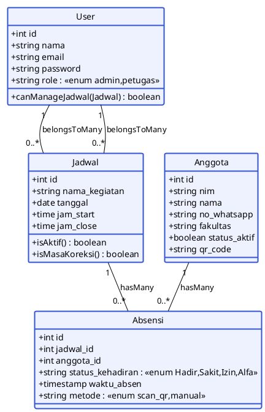

# SPESIFIKASI CLASS DIAGRAM
## Sistem Absensi Cerdas Berbasis QR Code — UKM Taekwondo (Laravel)

|                 |                                                                |
| --------------- | -------------------------------------------------------------- |
| **Nama Sistem** | Sistem Absensi Cerdas Berbasis QR Code UKM Taekwondo           |
| **Framework**   | Laravel (Eloquent ORM)                                          |
| **Penyusun**    | Software Architect & System Analyst                             |
| **Tanggal**     | Agustus 2026                                                    |

---

## 1. PENJELASAN KARDINALITAS RELASI

Relasi antar class (entitas) memetakan Model Eloquent Laravel ke tabel database relasional.

| Relasi | Kardinalitas | Class Sumber | Class Tujuan | Keterangan |
|---|---|---|---|---|
| **User ↔ Jadwal** | **Many-to-Many (M:N)** | `User` | `Jadwal` | Seorang petugas dapat ditugaskan pada banyak jadwal, dan satu jadwal dapat memiliki banyak petugas. Di Laravel diimplementasikan dengan relasi `belongsToMany` (milik dua arah) melalui tabel pivot `jadwal_petugas`. |
| **Anggota ↔ Absensi** | **One-to-Many (1:N)** | `Anggota` | `Absensi` | Satu anggota dapat memiliki banyak catatan kehadiran (Hadir/Sakit/Izin/Alfa) pada berbagai jadwal. Diimplementasikan dengan `hasMany` di `Anggota` dan `belongsTo` di `Absensi`. |
| **Jadwal ↔ Absensi** | **One-to-Many (1:N)** | `Jadwal` | `Absensi` | Satu jadwal dapat menampung banyak catatan absen dari banyak anggota. Diimplementasikan dengan `hasMany` di `Jadwal` dan `belongsTo` di `Absensi`. |

### Ringkasan Visual Kardinalitas
```
User (1) ──〈 M: M 〉── Jadwal (1)      → via tabel pivot jadwal_petugas
Anggota (1) ───〈 1 : N 〉─── Absensi (N)
Jadwal (1) ───〈 1 : N 〉─── Absensi (N)
```

> **Catatan teknik:** Relasi resmi dalam diagram hanya `User⇄Jadwal` (M:N),
> `Anggota→Absensi` (1:N) dan `Jadwal→Absensi` (1:N). Karena `Absensi`
> memiliki **dua foreign key** (`anggeta_id` dan `jadwal_id`), maka di sisi
> `Absensi` aku diimplementasikan **dua** relasi `belongsTo` (masing-masing ke
> `Anggota` dan ke `Jadwal`).

---

## 2. DIAGRAM — KODE MERMAID.JS (classDiagram)

Blok berikut dapat dirender langsung menggunakan editor Mermaid (mermaid.live, GitHub, Notion, MkDocs, dll).

````markdown
```mermaid
classDiagram
    direction TB

    %% ==================== CLASS USER ====================
    class User {
        +int id
        +string nama
        +string email
        +string password
        +string role  <<enum: admin; petugas>>
        +canManageJadwal(Jadwal) boolean
        +jadwals() Collection
    }

    %% ==================== CLASS ANGGOTA ====================
    class Anggota {
        +int id
        +string nim
        +string nama
        +string no_whatsapp
        +string fakultas
        +boolean status_aktif
        +string qr_code
        +absensis() Collection
    }

    %% ==================== CLASS JADWAL ====================
    class Jadwal {
        +int id
        +string nama_kegiatan
        +date tanggal
        +time jam_start
        +time jam_close
        +isAktif() boolean
        +isMasaKoreksi() boolean
        +users() Collection
        +absensis() Collection
    }

    %% ==================== CLASS ABSENSI ====================
    class Absensi {
        +int id
        +int jadwal_id
        +int anggota_id
        +string status_kehadiran  <<enum: Hadir; Sakit; Izin; Alfa>>
        +timestamp waktu_absen
        +string metode  <<enum: scan_qr; manual>>
        +jadwal() Jadwal
        +anggota() Anggota
    }

    %% ==================== RELASI ====================
    %% Many-to-Many via tabel pivot jadwal_petugas
    User "1" --> "0..*" Jadwal : belongsToMany
    Jadwal "0..*" --> "1" User : belongsToMany

    %% One-to-Many Anggota -> Absensi
    Anggota "1" --> "0..*" Absensi : hasMany
    Absensi "*" --> "1" Anggota : belongsTo

    %% One-to-Many Jadwal -> Absensi
    Jadwal "1" --> "0..*" Absensi : hasMany
    Absensi "*" --> "1" Jadwal : belongsTo

    %% ==================== STYLING ====================
    classDef entity fill:#EEF2FF,stroke:#3554D1,stroke-width:2px,color:#111827;
    class User,Anggota,Jadwal,Absensi entity;
```
````

> **Catatan:** Kode di atas menampilkan relasi ganda pada `Absensi` (ke `Anggota`
> dan ke `Jadwal`) sesuai implementasi `belongsTo` ganda pada Model Laravel.

---

## 3. DIAGRAM — PEMETAAN KE MODEL LARAVEL (REFERENSI KODE)

Struktur relasi di atas bila dipetakan ke Eloquent Model:

````php
// app/Models/User.php
class User extends Authenticatable
{
    public function jadwals()
    {
        return $this->belongsToMany(Jadwal::class, 'jadwal_petugas');
    }
}

// app/Models/Anggota.php
class Anggota extends Model
{
    public function absensis()
    {
        return $this->hasMany(Absensi::class);
    }
}

// app/Models/Jadwal.php
class Jadwal extends Model
{
    public function users()
    {
        return $this->belongsToMany(User::class, 'jadwal_petugas');
    }

    public function absensis()
    {
        return $this->hasMany(Absensi::class);
    }
}

// app/Models/Absensi.php
class Absensi extends Model
{
    public function anggota()
    {
        return $this->belongsTo(Anggota::class);
    }

    public function jadwal()
    {
        return $this->belongsTo(Jadwal::class);
    }
}
````

---

## 4. DIAGRAM — KODE PLANTUML (ALTERNATIF)

````markdown

````

---

*Dokumen ini merupakan spesifikasi Class Diagram versi 1.0. Atribut `id`, `created_at`, dan `updated_at` yang otomatis dimiliki Eloquent dihilangkan pada diagram agar ringkas, namun tetap ada di implementasi.*
