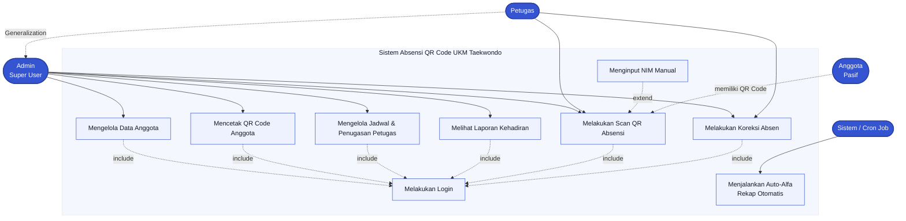
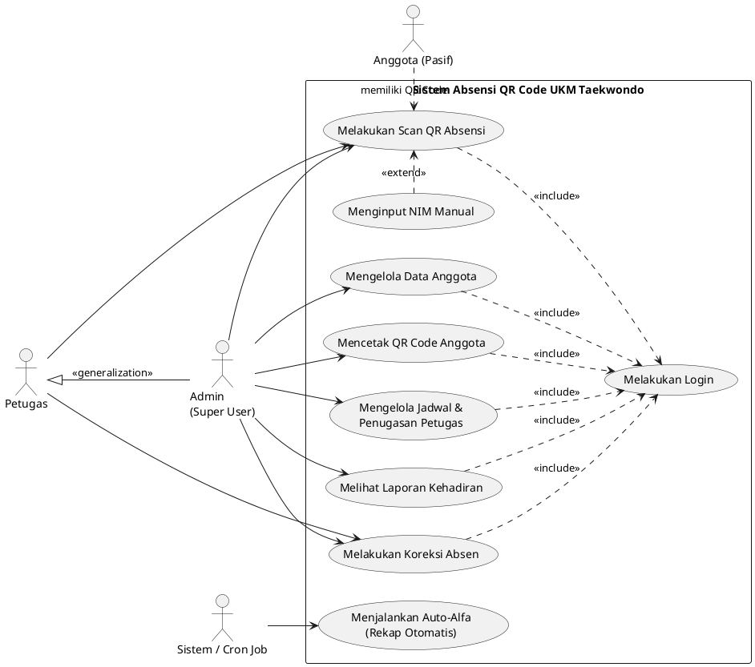

# SPESIFIKASI USE CASE DIAGRAM
## Sistem Absensi Cerdas Berbasis QR Code — UKM Taekwondo

|                 |                                                                |
| --------------- | -------------------------------------------------------------- |
| **Nama Sistem** | Sistem Absensi Cerdas Berbasis QR Code UKM Taekwondo           |
| **Penyusun**    | System Analyst                                                 |
| **Tanggal**     | Agustus 2026                                                    |

---

## 1. PENJELASAN RELASI AKTOR & USE CASE

### 1.1 Aktor
| Aktor | Tipe | Deskripsi |
|---|---|---|
| **Admin** | Primary (Super User) | Pengguna dengan hak akses penuh. Memiliki seluruh kemampuan Petugas (Relasi **Generalization**) ditambah kemampuan mengelola data master dan melihat laporan. |
| **Petugas** | Primary | Pengurus yang menjalankan presensi. Akses dibatasi hanya pada jadwal yang ditugaskan kepadanya. |
| **Anggota** | Secondary (Pasif) | Tidak login ke sistem. Berperan sebagai subjek yang **memiliki QR Code** untuk di-scan oleh Petugas. |
| **Sistem / Cron Job** | System (Otomatis) | Aktor otomatis berjalan di latar belakang (background process) tanpa interaksi manusia. |

### 1.2 Relasi Antar Aktor
- **Generalization (Admin → Petugas):** Admin **mewarisi** seluruh kemampuan Petugas. Artinya Admin dapat melakukan "Scan QR Absensi" dan "Koreksi Absen" di semua jadwal, sama seperti Petugas, namun tanpa batasan jadwal. Pada diagram, relasi ini digambarkan dari Petugas (anak) ke Admin (induk) dengan stereotip `<<generalization>>`.
- **Asosiasi (Association):** Garis yang menghubungkan aktor dengan use case yang boleh diaksesnya.

### 1.3 Relasi Antar Use Case
| Relasi | Keterangan |
|---|---|
| **<<include>>** | Login. Setiap aktivitas utama Admin & Petugas **wajib** meng-include use case "Melakukan Login". Artinya pemanggilan aktivitas tidak bisa berjalan tanpa proses login terlebih dahulu. |
| **<<extend>>** | Menginput NIM Manual. Merupakan perluasan opsional dari "Melakukan Scan QR Absensi". Use case ini hanya dijalankan **jika** pemindaian kamera QR gagal. |
| **Generalization** | Admin mewarisi kemampuan Petugas (scan & koreksi). |

### 1.4 Daftar Use Case & Pemetaan Aktor
| Use Case | Aktor | Jenis |
|---|---|---|
| Melakukan Login | Admin, Petugas | Include (wajib bagi semua aktivitas utama) |
| Mengelola Data Anggota | Admin | Tugas inti Admin |
| Mencetak QR Code Anggota | Admin | Tugas inti Admin |
| Mengelola Jadwal & Penugasan Petugas | Admin | Tugas inti Admin |
| Melihat Laporan Kehadiran | Admin | Tugas inti Admin |
| Melakukan Scan QR Absensi | Admin, Petugas | Tugas inti |
| Menginput NIM Manual | Petugas (Admin) | Extend dari Scan QR |
| Melakukan Koreksi Absen | Admin, Petugas | Tugas inti |
| Menjalankan Auto-Alfa (Rekap Otomatis) | Sistem / Cron Job | Tugas otomatis |

---

## 2. DIAGRAM — KODE MERMAID.JS

Blok berikut dapat dirender langsung menggunakan editor Mermaid (mermaid.live, GitHub, Notion, MkDocs, dll).

````markdown

````

### Catatan Visual
- **Aktor** digambar dengan bentuk kapsul (stadium) berwarna biru indigo `#3554D1`.
- **Use Case** digambar dengan kotak (rectangle) berwarna krem lembut.
- **System Boundary** direpresentasikan dengan subgraph berlabel "Sistem Absensi QR Code UKM Taekwondo" — seluruh use case berada di dalamnya, sedangkan aktor berada di luar.
- **Line putus-putus** mewakili relasi stereo (include / extend / generalization); **line solid** mewakili asosiasi biasa.

---

## 3. DIAGRAM — KODE PLANTUML (ALTERNATIF)

Jika menggunakan PlantUML, gunakan kode berikut dengan sintaks `plantuml`:

````markdown

````

> **Catatan Generalization:** Pada baris `Petugas <|-- Admin`, tanda panah kosong mengarah dari Admin (anak) ke Petugas (induk) sebagai penanda relasi pewarisan.

---

*Dokumen ini merupakan spesifikasi Use Case Diagram versi 1.0. Silakan sesuaikan jika terdapat perubahan pada hak akses aktor atau penambahan fitur.*
